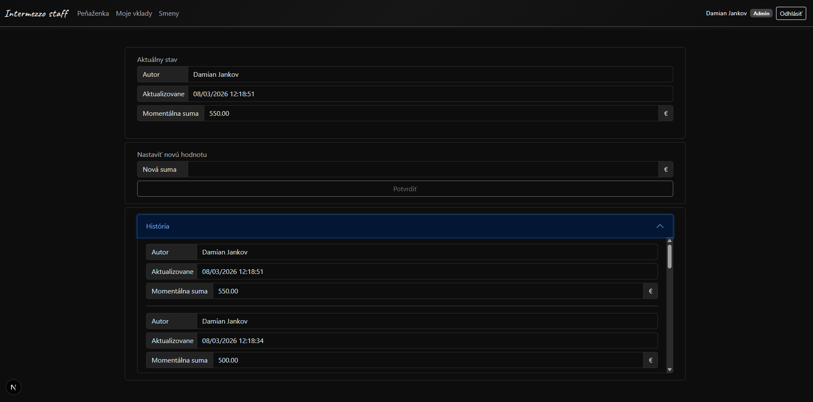
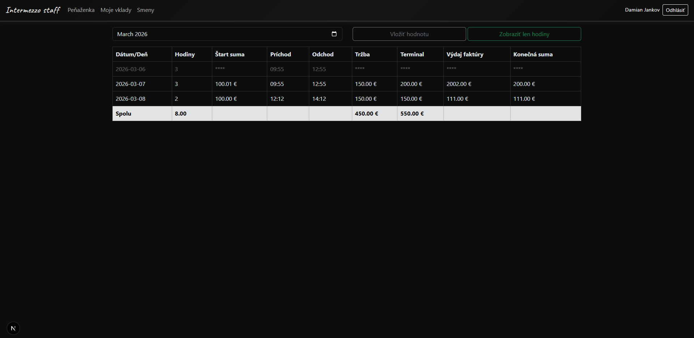
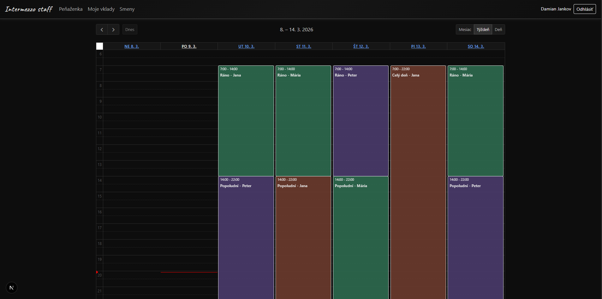

# Intermezzo Staff

A staff management and time-tracking web app for small businesses — built to track daily work inputs, cash flow, and shift schedules. Built for a small cafe in my home city.

---

## Tech Stack

| Layer | Technology |
|---|---|
| Framework | Next.js 16 (App Router) + React 19 + TypeScript |
| Auth | NextAuth v5 — Google OAuth |
| Database | MongoDB (Atlas) |
| UI | React Bootstrap 5 + Custom CSS Modules |
| Calendar | FullCalendar (day/week/month views) |
| Utilities | date-fns, react-spinners |
| Hosting | Vercel-ready (Next.js server actions) |

---

## Role-Based Access

Access is controlled via environment-level email whitelists:

- **Standard users** — can view and edit their own data only; edit window limited to current month + last 2 days
- **Admin users** — elevated privileges: view all employees' data, filter by employee, access full wallet history

Authentication is handled through Google OAuth — only whitelisted emails can log in.

---

## Pages

### Wallet `/wallet`
Tracks the business cash balance. Users can submit balance updates with a timestamp. Admins see the full history of all updates (shown in the História accordion); standard users see the current balance only.

---

### My Inputs `/myinputs`
Daily work log table. Each entry records hours worked, start/end times (auto-calculates hours), cash and terminal turnover, day expenses, and start/end float amounts. Filterable by month. Admins can view entries for all staff. Older entries outside the edit window are masked with `****`.

---

### Timetable `/timetable`
A color-coded shift calendar showing staff schedules. Powered by FullCalendar with day, week, and month views. Each employee is assigned a distinct color.

---
